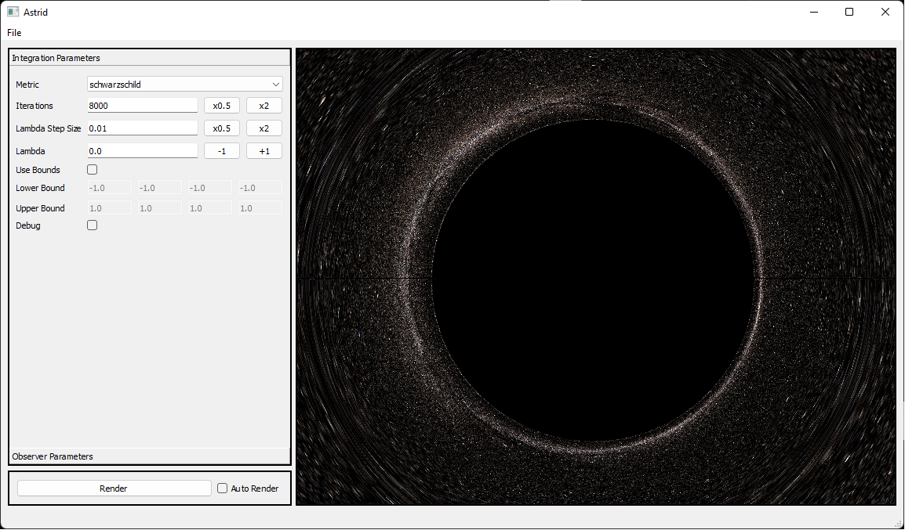

### Astrid
A relativistic ray tracing server and end-user application built on Astray.

### Requirements
- CMake 3.23+
- Astray 1.0+

### Installation
- Run `bootstrap.[bat|sh]`. This will install all dependencies except Astray, and create the project under the `./build` directory.
- Run cmake on the `./build` directory and point `astray_DIR` to the build directory of Astray.
- Configure, generate, build.

### Tutorial

- Run astrid.exe.
- Click the File menu and select "Connect to Local". This will create and connect to a local Astrid rendering server.
- In the "Integration Parameters" toolbox, choose the "Schwarzschild" metric.
- Click the "Render" button on the bottom left.
- Adjust the parameters and repeat.

### Interactive Rendering
- In the "Observer Parameters" toolbox, untoggle "Look at Origin". This will allow you to rotate using the mouse.
- Toggle the "Auto Render" on the bottom left.
- Use the keyboard (WASD) and the mouse to interactively browse the metric.

### Notes
- The screen size has an effect on performance. More the pixels, slower the rendering.